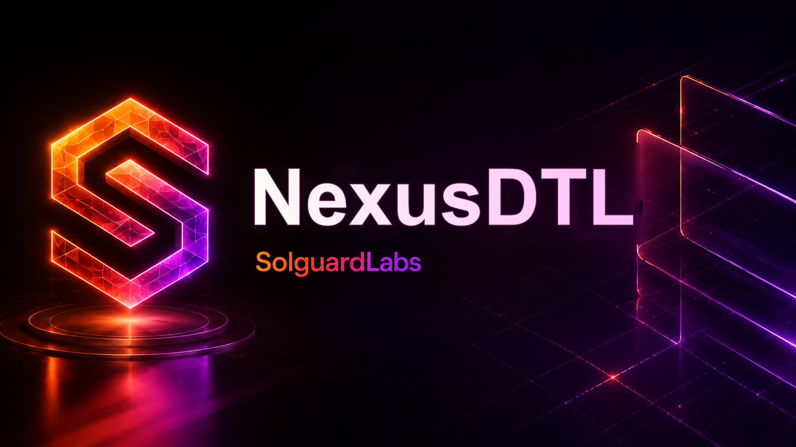

# Nexus DTL



Nexus DTL es un prototipo de protocolo de liquidacion programable escrito en
Rust. El sistema modela una capa de ejecucion para intentos firmados, rutas RFQ,
subastas de solver, controles de riesgo, netting, tesoreria y vaults de
liquidez.

El objetivo del proyecto es representar una base tecnica cercana a un protocolo
real: estado determinista, serializacion canonica, firmas, journal de ejecucion
y escenarios reproducibles desde la CLI.

## Capacidades Principales

- Ledger determinista con balances por cuenta y activo.
- Identidades publicas derivadas de claves Ed25519.
- Intentos de ejecucion firmados por usuarios.
- Batches de liquidacion firmados por coordinadores.
- Vaults de liquidez con depositos, participaciones y salidas diferidas.
- Motor de riesgo con limites de notional, utilizacion y reservas minimas.
- Libro de credito con facilities y draws contra reservas.
- Libro de oraculos con publishers registrados y observaciones por mercado.
- Subastas de rutas con lanes, bids de solver y seleccion de precio.
- Netting de obligaciones por activo antes de liquidacion.
- Tesoreria con politica de fees, fondo de seguro y devengos internos.
- Gobierno operativo con roles para coordinadores, solvers, oraculos y tesoreria.

## Estructura

```text
src/
  amount/       Unidades monetarias y basis points.
  auction/      Lanes de subasta y bids de solver.
  codec/        Serializacion canonica para digests.
  credit/       Facilities de credito y posiciones.
  crypto/       Identidades, claves y firmas.
  error/        Tipos de error del protocolo.
  governance/   Roles operativos y configuracion de gobierno.
  ids/          Tipos fuertes para cuentas, activos, vaults y digests.
  ledger/       Estado principal, cuentas, journal y ejecucion atomica.
  market/       Assets, quotes, intentos y batches de liquidacion.
  netting/      Obligaciones y reportes netos por activo.
  oracle/       Publishers, observaciones y bandas de precio.
  risk/         Limites y evaluacion de batches.
  runtime/      CLI y escenarios reproducibles.
  treasury/     Politica economica, seguro y devengos.
  vault/        Vaults de liquidez, posiciones y tickets de salida.
tests/
  node/         Suite de integracion en JavaScript con Bun.
  helpers/      Utilidades compartidas para tests Node.
```

## Requisitos

- Rust 1.96 o superior.
- Bun 1.3 o superior.

## Uso

Ejecutar el escenario por defecto:

```bash
cargo run --quiet
```

Ejecutar escenarios concretos:

```bash
cargo run --quiet -- snapshot
cargo run --quiet -- routed
cargo run --quiet -- credit
cargo run --quiet -- exit
```

Cada escenario devuelve un reporte JSON con estado de vault, balances, superficie
operativa, transacciones emitidas, digest de estado y comprobacion de
conservacion.

## Pruebas

Suite Rust:

```bash
cargo test --locked
```

Suite JavaScript:

```bash
bun test --timeout 30000 ./tests/node
```

Suite completa:

```bash
bun run test:all
```

## Verificacion Local

Formato y build Rust:

```bash
cargo fmt --all -- --check
cargo build --all-targets --locked
```

Lint Rust:

```bash
cargo clippy --all-targets --all-features --locked -- -D warnings
```

Formato JavaScript:

```bash
bun run fmt:check
```

## CI

El repositorio incluye GitHub Actions y Dependabot:

- `.github/workflows/ci.yml` define la verificacion del proyecto.
- `.github/dependabot.yml` mantiene dependencias de Cargo, Bun/npm y Actions.

## Estado del Proyecto

Nexus DTL es un laboratorio tecnico. La implementacion esta disenada para
auditoria, revision de arquitectura y validacion de flujos economicos simulados.
No debe conectarse a fondos reales, claves de produccion ni infraestructura de
terceros sin un proceso formal de endurecimiento, revision independiente y
validacion operacional.
